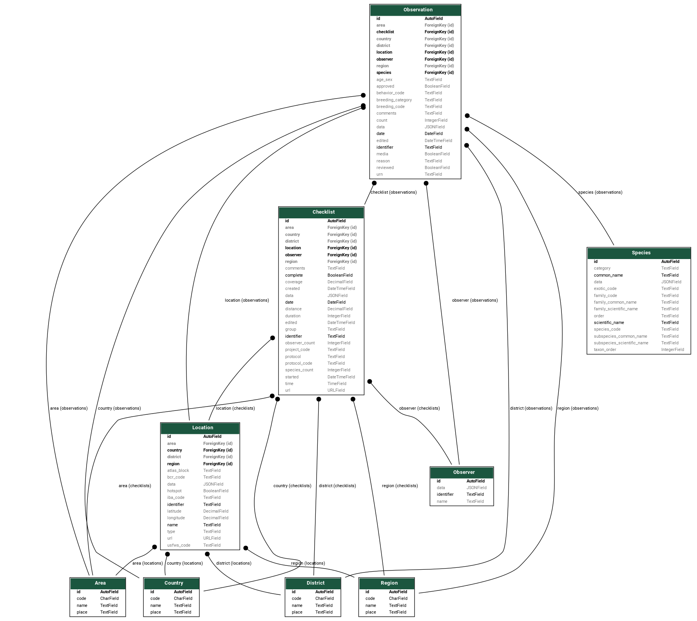

===============
Database Schema
===============
ebird-checklists loads the data into five Django model: Checklist, Location,
Observer, Observation and Species:

The lightning tour in 15 seconds:

* A Checklist has a Location.
* A Checklist has an Observer.
* A Checklist has a Location.
* A Checklist has a list of Observations.
* An Observation belongs to a Checklist.
* An Observation has a Species.
* An Observation has a Location.
* An Observation has an Observer.

Notes
-----
1. Location and Observer are duplicated on Observation to make queries easy.

2. The models use TextField as it works equally well with SQLite3 and PostgreSQL
   as CharField. This means there will not be a problem if the size of strings
   from eBird get longer.

3. The Observer is the person who submitted the checklist to eBird. If the checklist
   was shared or other people in the group also submitted a checklist then the `group`
   attribute on `Checklist` will contain an identifier which can be used to link
   them together.

4. Each models has a JSONField for adding features without having to extend the
   models. Some examples:

   * On the Species model you can store a table of translations for the species
     common name

     .. code-block:: json

        {
           "en": "Gray Plover",
           "en-UK": "Grey Plover",
           "en-US": "Black-bellied Plover",
           "es": "Chorlito gris",
           "es-MX": "Chorlo Gris",
           "es-CL": "Chorlo ártico",
        }

   * Often the eBird site names have extra information added to help identify
     identify all the sites in a given area, and also indicate any access
     restrictions. For example:

     .. code-block:: console

        RN Estuário do Tejo--Ponta da Erva (acesso condicionado).

     You can add a display name value to the JSONField to show a shortened
     version instead of the "official" name:

     .. code-block:: json

        {
          "display-name": "Ponta da Erva"
        }

     The task pf processing the name is left as an exercise for the reader.
